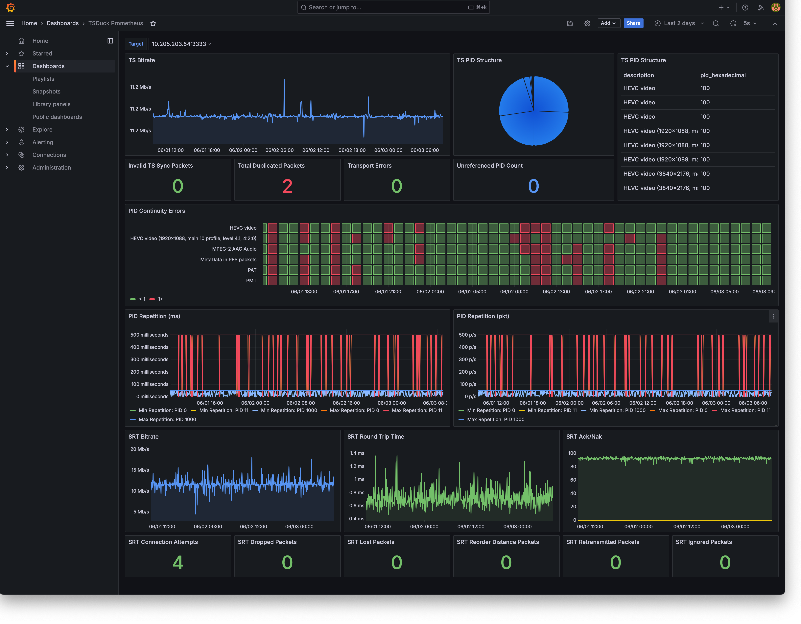

# TSDuck Prometheus

TSDuck Prometheus is a tool to export values from a TSDuck analyser pipeline into Prometheus, to enable you to build realtime Grafana dashboards for monitoring of MPEG-TS transport streams from an SRT Listener

The metrics exported try to cover most of ETR290 Priority 1

Running tsduck-prometheus will expose port 8000, you can access the metrics endpoint as such: http://localhost:8000/metrics

## Using this tool

### Compiling 

Make sure you have TSDuck, FFmpeg, and Go version >1.18 installed, and can run 'tsp' and 'ffmpeg' commands on your machine. Clone this repo and build using the following commands...

```
go mod tidy
go build -o tsduck-prometheus
./tsduck-prometheus -t 10.205.203.64:3333 -l My_Device_Name
```

### Docker

A Dockerfile is included on this repository, it's not perfect at the moment (the image size could likely be smaller) but it works

Local to the Dockerfile, the following commands can be used to get started using Docker with host networking mode 

```
docker build -t tsduck-prometheus .
docker run -d --network host tsduck-prometheus -t 10.205.203.64:3333 -l My_Device_Name
```

## Example Grafana Dashboard

An example dashboard is included on the repository to get you started (see [dashboard.json](dashboard.json))



